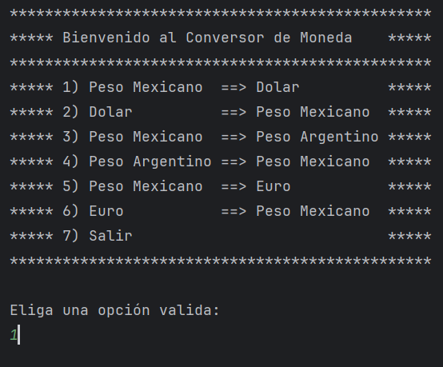

# Conversor de Moneda

Esta es una aplicación de consola en Java que convierte monedas utilizando la API de ExchangeRate-API.

## Requisitos

- Java 8 o superior
- Gson (debe agregar el archivo JAR de Gson a su proyecto)

## Instalación

1. Clone el repositorio en su máquina local:

    ```bash
    git clone https://github.com/Alexis-Rueda/conversor-java.git
    ```

2. Descargue el archivo JAR de Gson desde [Maven Repository](https://mvnrepository.com/artifact/com.google.code.gson/gson) y agrégalo a tu proyecto.

3. Cambie el nombre del archivo `ApiInfoTemplate.java` a `ApiInfo.java` y agregue su clave de API en la variable `apiKey`:

    ```java
    public class ApiInfo {
        public static final String apiKey = "SU_CLAVE_DE_API_AQUI";
    }
    ```

## Ejemplo de Uso


